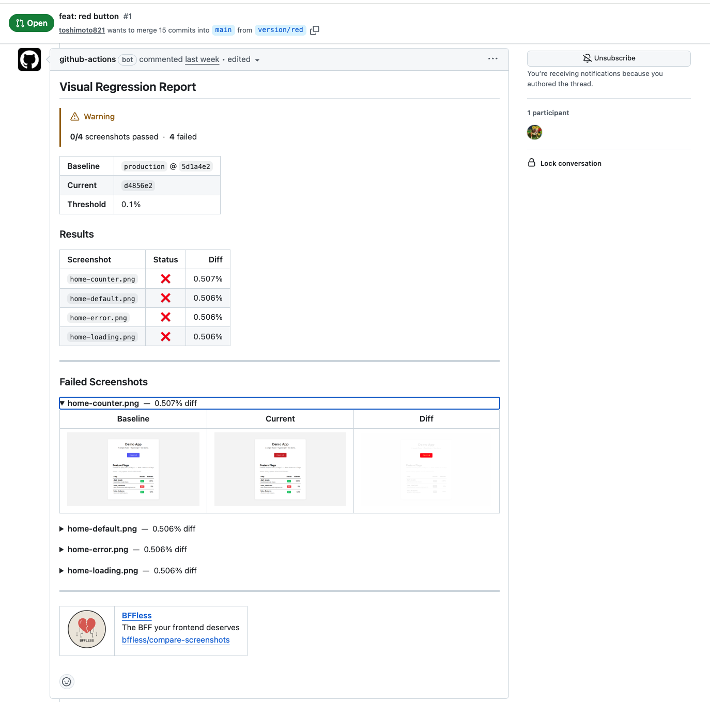

# BFFLESS Compare Screenshots

A GitHub Action for visual regression testing that compares screenshots against a BFFLESS baseline.

## Features

- **Download** baseline screenshots from BFFLESS using an alias
- **Compare** local screenshots against the baseline using pixelmatch
- **Generate** diff images for visual differences
- **Upload** results (PR screenshots + diffs) to BFFLESS
- **Output** structured comparison report and GitHub step summary

## Quick Start

```yaml
- name: Compare screenshots
  uses: bffless/compare-screenshots@v1
  with:
    path: ./screenshots
    baseline-alias: screenshots-production
    api-url: ${{ vars.ASSET_HOST_URL }}
    api-key: ${{ secrets.ASSET_HOST_KEY }}
```

This replaces ~50 lines of workflow configuration with a single action.

## Inputs

| Input                   | Required | Default                           | Description                                        |
| ----------------------- | -------- | --------------------------------- | -------------------------------------------------- |
| `path`                  | Yes      | -                                 | Path to local screenshots directory                |
| `baseline-alias`        | Yes      | -                                 | BFFLESS alias containing baseline screenshots      |
| `api-url`               | Yes      | -                                 | BFFLESS API URL                                    |
| `api-key`               | Yes      | -                                 | BFFLESS API key                                    |
| `threshold`             | No       | `0.1`                             | Percentage diff tolerance (0-100)                  |
| `pixel-threshold`       | No       | `0.1`                             | Per-pixel color threshold (0-1)                    |
| `include-anti-aliasing` | No       | `false`                           | Include anti-aliasing differences                  |
| `upload-results`        | No       | `true`                            | Upload PR screenshots and diffs to BFFLESS         |
| `screenshots-alias`     | No       | `screenshots-pr-{pr_number}`      | Alias for uploaded PR screenshots                  |
| `diffs-alias`           | No       | `screenshot-diffs-pr-{pr_number}` | Alias for uploaded diff images                     |
| `repository`            | No       | Current repo                      | Repository in owner/repo format                    |
| `output-dir`            | No       | `./screenshot-diffs`              | Directory for diff images                          |
| `fail-on-difference`    | No       | `true`                            | Fail the action if differences detected            |
| `summary`               | No       | `true`                            | Generate GitHub step summary                       |
| `summary-images`        | No       | `auto`                            | Include images in summary: `auto`, `true`, `false` |

## Outputs

| Output                | Description                                               |
| --------------------- | --------------------------------------------------------- |
| `total`               | Total number of screenshots compared                      |
| `passed`              | Number of screenshots that passed                         |
| `failed`              | Number of screenshots that failed                         |
| `new`                 | Number of new screenshots (not in baseline)               |
| `missing`             | Number of missing screenshots (in baseline but not local) |
| `result`              | Overall result: `pass`, `fail`, or `error`                |
| `report`              | JSON report contents                                      |
| `baseline-commit-sha` | Commit SHA of the baseline screenshots                    |
| `baseline-is-public`  | Whether baseline screenshots are publicly accessible      |
| `screenshots-url`     | URL to uploaded PR screenshots                            |
| `diffs-url`           | URL to uploaded diff images                               |

## Usage Examples

### Basic Usage

```yaml
- name: Run Playwright tests
  run: pnpm test:vrt

- name: Compare screenshots
  uses: bffless/compare-screenshots@v1
  with:
    path: ./screenshots
    baseline-alias: screenshots-production
    api-url: ${{ vars.ASSET_HOST_URL }}
    api-key: ${{ secrets.ASSET_HOST_KEY }}
```

### With Custom Threshold

```yaml
- name: Compare screenshots
  uses: bffless/compare-screenshots@v1
  with:
    path: ./screenshots
    baseline-alias: screenshots-production
    api-url: ${{ vars.ASSET_HOST_URL }}
    api-key: ${{ secrets.ASSET_HOST_KEY }}
    threshold: 0.5 # Allow 0.5% diff
    fail-on-difference: false # Don't fail, just report
```

### Using Outputs for Custom Comments

```yaml
- name: Compare screenshots
  id: vrt
  uses: bffless/compare-screenshots@v1
  with:
    path: ./screenshots
    baseline-alias: screenshots-production
    api-url: ${{ vars.ASSET_HOST_URL }}
    api-key: ${{ secrets.ASSET_HOST_KEY }}

- name: Comment on PR
  if: steps.vrt.outputs.result == 'fail'
  uses: actions/github-script@v7
  with:
    script: |
      const report = JSON.parse(process.env.VRT_REPORT);
      const isPublic = process.env.IS_PUBLIC === 'true';

      let body = `## Visual Regression: ${report.summary.failed} failures\n\n`;

      // Add failure details
      for (const result of report.results.filter(r => r.status === 'fail')) {
        body += `- **${result.name}**: ${result.diffPercentage.toFixed(3)}% diff\n`;
      }

      // Add image links if public
      if (isPublic && process.env.DIFFS_URL) {
        body += `\n[View diffs](${process.env.DIFFS_URL})`;
      }

      github.rest.issues.createComment({
        owner: context.repo.owner,
        repo: context.repo.repo,
        issue_number: context.issue.number,
        body
      });
  env:
    VRT_REPORT: ${{ steps.vrt.outputs.report }}
    IS_PUBLIC: ${{ steps.vrt.outputs.baseline-is-public }}
    DIFFS_URL: ${{ steps.vrt.outputs.diffs-url }}
```

### Complete Workflow

```yaml
name: Visual Regression Tests

on:
  pull_request:
    branches: [main]

jobs:
  vrt:
    runs-on: ubuntu-latest
    steps:
      - uses: actions/checkout@v4

      - name: Setup Node.js
        uses: actions/setup-node@v4
        with:
          node-version: '20'
          cache: 'pnpm'

      - name: Install dependencies
        run: pnpm install

      - name: Install Playwright browsers
        run: pnpm exec playwright install chromium

      - name: Build app
        run: pnpm build

      - name: Capture screenshots
        run: pnpm test:vrt

      - name: Compare screenshots
        uses: bffless/compare-screenshots@v1
        with:
          path: ./screenshots
          baseline-alias: screenshots-production
          api-url: ${{ vars.ASSET_HOST_URL }}
          api-key: ${{ secrets.ASSET_HOST_KEY }}
```

## How It Works

1. **Download Baseline**: Fetches baseline screenshots from BFFLESS using the specified alias
2. **Compare**: Uses pixelmatch to compare each local screenshot against its baseline
3. **Generate Diffs**: Creates diff images highlighting visual differences
4. **Upload Results**: Uploads PR screenshots and diff images to BFFLESS (optional)
5. **Report**: Generates a JSON report and GitHub step summary

## PR Comment Example

The action can post a comment like this on pull requests:



<details>
<summary>Comment Markdown</summary>

```markdown
## Visual Regression Report

> [!WARNING]
> **0/4** screenshots passed · **4** failed

<table>
<tr><td><strong>Baseline</strong></td><td><code>production</code> @ <code>5d1a4e2</code></td></tr>
<tr><td><strong>Current</strong></td><td><code>d4856e2</code></td></tr>
<tr><td><strong>Threshold</strong></td><td>0.1%</td></tr>
</table>

### Results

| Screenshot         | Status |   Diff |
| :----------------- | :----: | -----: |
| `home-counter.png` |   ❌   | 0.507% |
| `home-default.png` |   ❌   | 0.506% |
| `home-error.png`   |   ❌   | 0.506% |
| `home-loading.png` |   ❌   | 0.506% |

---

### Failed Screenshots

<details>
<summary><strong>home-counter.png</strong> — 0.507% diff</summary>

|                                Baseline                                 |                                Current                                 |                                   Diff                                    |
| :---------------------------------------------------------------------: | :--------------------------------------------------------------------: | :-----------------------------------------------------------------------: |
|  |  |  |

</details>
```

</details>

## Summary Output

The action generates a GitHub step summary with:

- Overall pass/fail status
- Results table for all screenshots
- Detailed failure sections with:
  - Embedded images (if public)
  - Links to baseline/current/diff images
- Lists of new and missing screenshots

### Public vs Private Images

The `summary-images` input controls how images are displayed:

- `auto` (default): Embed images if the baseline is public, otherwise show links
- `true`: Always embed image URLs (user asserts they're accessible)
- `false`: Never embed images, only show text

## License

[O'Saasy License](LICENSE.md)
